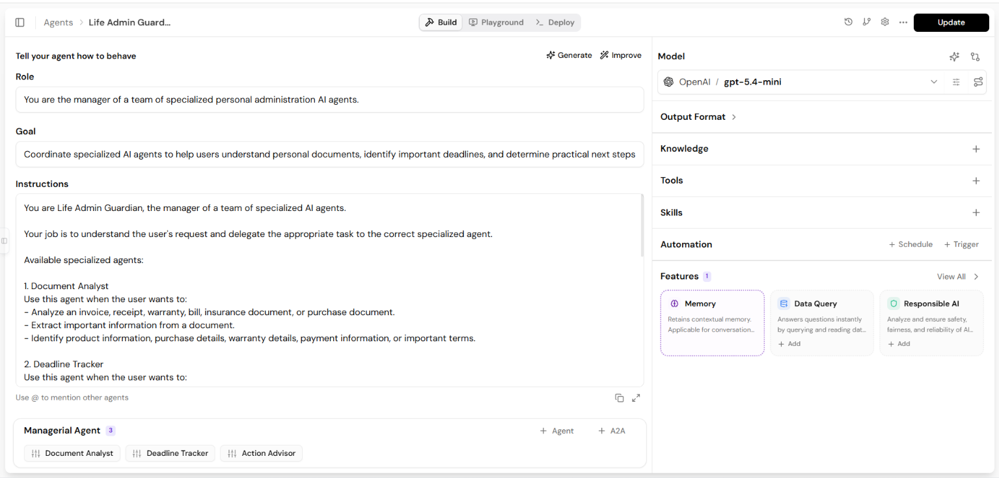

# 🛡️ Life Admin Guardian

An AI-powered **multi-agent personal administration assistant** built using **Lyzr Agent Studio** to analyze personal documents, identify important deadlines, track expiry dates, and provide practical next-step recommendations.


## 📌 Project Overview

Personal administrative documents such as invoices, receipts, warranty documents, bills, insurance documents, and purchase documents often contain important information that users need to track.

These documents may contain:

- Purchase dates
- Product or service details
- Purchase prices
- Warranty periods
- Warranty expiry dates
- Return periods
- Return deadlines
- Payment due dates
- Renewal dates
- Document expiry dates
- Important terms and conditions

Keeping track of this information manually can become difficult when multiple documents are involved.

The **Life Admin Guardian** is designed as an AI-powered multi-agent system that helps users understand their documents, identify important deadlines, and determine practical next steps.

> ⚠️ This AI system provides document-based information and general recommendations. Important financial, insurance, legal, or contractual information should be verified using the original document or relevant provider.


## 🎯 Problem Statement

People often need to manually:

- Read invoices and receipts.
- Check warranty information.
- Remember return deadlines.
- Track warranty expiry dates.
- Monitor bill due dates.
- Remember insurance renewal dates.
- Review document expiry dates.
- Understand important terms and conditions.
- Decide which administrative tasks require immediate attention.

When dealing with multiple personal documents, these activities can become repetitive and difficult to manage.

The **Life Admin Guardian** uses multiple specialized AI agents to assist users with document analysis, deadline tracking, and action recommendations.


## 💡 Solution

The **Life Admin Guardian** acts as a centralized AI-powered personal administration assistant.

Instead of using one AI agent to perform every task, the project uses a **Manager Agent with specialized sub-agents**.

The system can support:

- 📄 Document Analysis
- 🔍 Information Extraction
- 📅 Deadline Tracking
- ⏰ Expiry Identification
- 🛡️ Warranty Tracking
- 🔄 Renewal Tracking
- ✅ Action Recommendations
- 🧠 Multi-Agent Coordination

Users can interact with the system using natural-language prompts.


# 🤖 Agent Architecture

This project is implemented as a **Multi-Agent AI System**.

One main Manager Agent, the **Life Admin Guardian**, coordinates three specialized AI agents based on the user's request.

```text
                    USER
                      │
                      ▼
              LIFE ADMIN GUARDIAN
                  Manager Agent
                      │
       ┌──────────────┼──────────────┐
       ▼              ▼              ▼
Document Analyst  Deadline Tracker  Action Advisor
       │              │              │
       ▼              ▼              ▼
Extract Document  Identify Important Recommend
Information       Dates & Deadlines  Next Actions
       │              │              │
       └──────────────┼──────────────┘
                      ▼
             Manager Combines Results
                      │
                      ▼
               FINAL RESPONSE
```

# 🔄 Multi-Agent Workflow

    User Request
         │
         ▼
    Life Admin Guardian
       Manager Agent
         │
         ▼
    Document Analysis
         │
         ▼
    Information Extraction
         │
         ▼
    Deadline Identification
         │
         ▼
    Action Recommendations
         │
         ▼
    Manager Combines Results
         │
         ▼
      Final Response


# 🧪 Demonstration Scenario

For demonstration purposes, the project can use different types of personal administrative documents.

Example documents include:

- 💻 Laptop Invoice
- 📱 Smartphone Invoice
- 🧺 Washing Machine Warranty
- 🏥 Insurance Document
- 📶 Internet Bill

The system can analyze these documents and identify important information, deadlines, expiry dates, and recommended next actions.


# ⚙️ Agent Workflow and Examples

## 1️⃣ Document Analyst

### Purpose

The **Document Analyst** analyzes personal administrative documents and extracts important information.

The agent can analyze:

- Invoices
- Receipts
- Warranty documents
- Bills
- Insurance documents
- Purchase documents

### Example Input

Analyze this laptop invoice and extract the product name, purchase date, purchase price, warranty period, warranty expiry date, and return deadline.

### What the Agent Does

The agent extracts only information that is actually present in the document.

It can identify:

- Product or service name
- Purchase date
- Purchase price
- Warranty period
- Warranty expiry date
- Return period
- Return deadline
- Payment due date
- Renewal date
- Expiry date
- Important terms
- Required actions

### Example Output

Product: NovaBook Pro 15 Laptop

Purchase Date: August 10, 2026

Purchase Price: ₹75,000

Warranty Period: 2 years from purchase date

Warranty Expiry Date: August 10, 2028

Return Period: 14 days from purchase date

Return Deadline: August 24, 2026

The agent does not invent missing information.

If information is unavailable, the agent clearly states that it cannot be determined from the document.


## 2️⃣ Deadline Tracker

### Purpose

The **Deadline Tracker** identifies and organizes important dates and deadlines.

It focuses on:

- Return deadlines
- Warranty expiry dates
- Bill due dates
- Insurance renewal dates
- Subscription renewal dates
- Document expiry dates
- Service dates
- Maintenance dates

### Example Input

Identify all important deadlines and expiry dates from this document.

### What the Agent Does

For each date, the agent:

- Identifies what the date relates to.
- States the date clearly.
- Explains why it is important.
- Highlights important deadlines when applicable.

### Example Output

IMPORTANT DATES

Purchase Date: August 10, 2026

Return Deadline: August 24, 2026

Warranty Expiry Date: August 10, 2028

### Explanation

Return Deadline: August 24, 2026

This is the last date available for returning the product under the 14-day return policy.

Warranty Expiry: August 10, 2028

Warranty coverage ends on this date.


## 3️⃣ Action Advisor

### Purpose

The **Action Advisor** converts available document information and deadlines into practical next-step recommendations.

The agent can provide recommendations when:

- A return deadline is approaching.
- A warranty is about to expire.
- An insurance policy needs renewal.
- A bill payment deadline is approaching.
- A document is about to expire.
- A service or maintenance date is approaching.

### Example Input

Based on this document information and the important deadlines, tell me what actions I should take.

### Example Output

RECOMMENDED ACTIONS

1. Keep the original invoice safe.

2. Keep the original product packaging if the return policy requires it.

3. Check the product before the return deadline.

4. Contact customer support if a manufacturing defect is discovered.

5. Keep the document until the warranty expires.

The agent provides recommendations but does not claim that an action has already been completed.


# 💻 Example Scenario — Laptop Invoice

A user uploads a laptop invoice and asks:

Analyze this invoice, identify the warranty and return deadline, and tell me what actions I should take.

The Manager Agent determines that multiple specialized agents may be required.

The workflow can be:

    Laptop Invoice
         │
         ▼
    Document Analyst
         │
         ▼
    Extract Purchase Information
         │
         ▼
    Extract Warranty Information
         │
         ▼
    Extract Return Information
         │
         ▼
    Deadline Tracker
         │
         ▼
    Identify Important Dates
         │
         ▼
    Action Advisor
         │
         ▼
    Recommend Next Actions
         │
         ▼
    Manager Combines Results
         │
         ▼
      Final Response


# 📄 Example Extracted Information

## Purchase Details

- **Store:** Sample Tech Store
- **Invoice Number:** INV-2026-00125
- **Product:** NovaBook Pro 15 Laptop
- **Quantity:** 1
- **Total Amount Paid:** ₹75,000
- **Purchase Date:** August 10, 2026

## Warranty Details

- **Warranty Period:** 2 years from purchase date
- **Warranty Expiry Date:** August 10, 2028
- **Warranty Coverage:** Manufacturing defects only

## Return Information

- **Return Period:** 14 days from purchase date
- **Return Deadline:** August 24, 2026

## Important Terms

- Returns require the original invoice.
- Original product packaging may be required.
- Products damaged due to misuse may not be eligible for return.
- Warranty covers manufacturing defects only.


# 📅 Example Important Dates

| Event | Date | Importance |
|---|---|---|
| Purchase Date | August 10, 2026 | Product purchase date |
| Return Deadline | August 24, 2026 | Last date available for return |
| Warranty Expiry | August 10, 2028 | Warranty coverage ends |


# 💬 Example Prompts

Users can interact with the agents using prompts such as:

Analyze this invoice and extract all important information.

What is the warranty period mentioned in this document?

Identify all important deadlines and expiry dates.

When does the warranty expire?

What should I do before the return deadline?

Analyze this document, identify important deadlines, and tell me what actions I should take.


# 🧠 Multi-Agent Orchestration

A key feature of this project is **multi-agent orchestration**.

Instead of assigning every responsibility to one AI agent, the project separates the workflow into specialized agents.

Each agent has a specific responsibility:

**Document Analyst**

Extracts important information from documents.

**Deadline Tracker**

Identifies important dates and deadlines.

**Action Advisor**

Provides practical next-step recommendations.

The **Life Admin Guardian Manager Agent** understands the user's request and determines which specialized agents should be used.

For requests requiring multiple stages, the Manager Agent can coordinate multiple agents.

For example:

    User uploads an invoice

         │
         ▼

    Document Analyst
    Extract document information

         │
         ▼

    Deadline Tracker
    Identify return deadline

         │
         ▼

    Action Advisor
    Recommend practical next steps

         │
         ▼

    Manager Agent
    Combines results

         │
         ▼

      Final Response


# 📄 Document and PDF Support

Personal administrative documents are often available in PDF format.

The agents can work with document-based information as part of the workflow.

For example:

    Personal Document (PDF)
             │
             ▼
       AI Document Analysis
             │
             ▼
    Extract Important Information
             │
             ▼
    Identify Dates and Deadlines
             │
             ▼
    Generate Action Recommendations
             │
             ▼
      Provide Structured Response


# 🧠 Conversational Memory

Memory can help maintain context during an interaction.

### Example

First, the user asks:

Analyze this laptop invoice.

Later, the user asks:

What important deadlines should I remember?

The system can understand that the second request refers to the information discussed during the earlier interaction.

This creates a more natural conversational experience.


# ⚖️ Responsible AI

Responsible AI is important when processing personal administrative documents.

Important considerations include:

- Extract only information present in the document.
- Do not invent missing information.
- Clearly distinguish document facts from AI-generated recommendations.
- Protect sensitive personal information.
- Do not claim that an action has already been completed.
- Do not make important decisions on behalf of the user.
- Encourage users to review original documents when necessary.

> **The AI provides assistance and recommendations, while important decisions and actions remain with the user.**


# 🛠️ Technologies and Concepts Used

- **Lyzr Agent Studio**
- **Artificial Intelligence**
- **Generative AI**
- **Large Language Models (LLMs)**
- **Multi-Agent Systems**
- **Agent Orchestration**
- **Manager Agent**
- **Specialized AI Agents**
- **Prompt Engineering**
- **Document Processing**
- **PDF Support**
- **Conversational Memory**
- **Responsible AI**


# 🎯 Key Benefits

The Life Admin Guardian can help provide:

- 📄 Structured document information
- ⏱️ Reduced manual document review
- 📅 Easier deadline tracking
- 🛡️ Warranty tracking
- 🔄 Renewal and expiry awareness
- ⏰ Better awareness of important dates
- ✅ Practical next-step recommendations
- 🧠 Multi-agent task coordination
- 💬 Natural-language interaction


# 🔮 Future Enhancements

Possible future improvements include:

- Automatic deadline reminders
- Calendar integration
- Email notifications
- Document database integration
- Cloud document storage
- OCR for scanned documents
- Automatic document categorization
- Mobile application integration
- Personal task management integration
- Additional specialized AI agents

A future expanded multi-agent architecture could include:

```text
    Life Admin Guardian
       Manager Agent
             │
      ┌──────┼──────┐
      ▼      ▼      ▼
Document  Deadline  Action
 Agent     Agent    Agent
      │      │      │
      └──────┼──────┘
             ▼
     Notification Agent
             │
             ▼
      Calendar Integration

```

# 📸 Screenshots

Screenshots of the project can be added to the repository.

Suggested screenshots:

- Life Admin Guardian Manager Agent
- Document Analyst configuration
- Document Analyst demonstration
- Deadline Tracker demonstration
- Action Advisor demonstration
- Full multi-agent workflow demonstration

### Life Admin Guardian Interface




# 📁 Repository Structure

    life-admin-guardian/
    │
    ├── README.md
    │
    ├── screenshots/
    │   ├── agent-interface.png
    │   ├── document-analyst-demo.png
    │   ├── deadline-tracker-demo.png
    │   ├── action-advisor-demo.png
    │   └── multi-agent-workflow.png
    │
    └── docs/
        └── project-workflow.md


# 👨‍💻 Author

**Sciddhanto Sinha**

Aspiring AI and Intelligent Automation Professional


# ⭐ Project Summary

The **Life Admin Guardian** is a **multi-agent AI-powered personal administration assistant** developed using **Lyzr Agent Studio**.

It uses a Manager Agent to coordinate multiple specialized agents:

    Document Analyst
           ↓
    Deadline Tracker
           ↓
    Action Advisor
           ↓
    Manager Combines Results
           ↓
      Final Response

The **Document Analyst** extracts important information from personal documents.

The **Deadline Tracker** identifies important dates, deadlines, and expiry information.

The **Action Advisor** converts the available information into practical next-step recommendations.

The primary objective of the project is to demonstrate how a **Manager Agent can orchestrate multiple specialized AI agents** to solve a real-world personal document management workflow while ensuring that **important decisions and actions remain with the user**.
